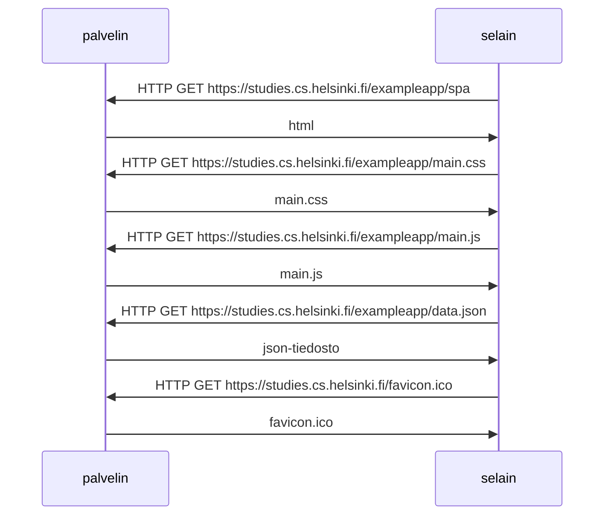

```mermaid
sequenceDiagram
  participant p as palvelin
  participant s as selain
  
  s->>p: HTTP GET https://studies.cs.helsinki.fi/exampleapp/spa
  p->>s: html
  s->>p: HTTP GET https://studies.cs.helsinki.fi/exampleapp/main.css
  p->>s: main.css
  s->>p: HTTP GET https://studies.cs.helsinki.fi/exampleapp/main.js
  p->>s: main.js
  s->>p: HTTP GET https://studies.cs.helsinki.fi/exampleapp/data.json
  p->>s: json-tiedosto
  s->>p: HTTP GET https://studies.cs.helsinki.fi/favicon.ico
  p->>s: favicon.ico
```
