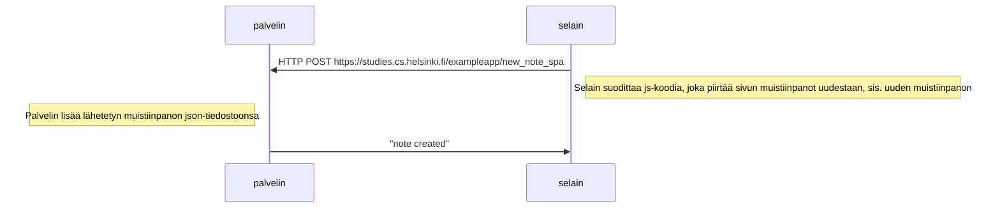

```mermaid
sequenceDiagram
  participant p as palvelin
  participant s as selain
  
  s->>p: HTTP POST https://studies.cs.helsinki.fi/exampleapp/new_note_spa
  note right of s: Selain suodittaa js-koodia, joka piirtää sivun muistiinpanot uudestaan, sis. uuden muistiinpanon
  note left of p: Palvelin lisää lähetetyn muistiinpanon json-tiedostoonsa
  p->>s: "note created"

```
